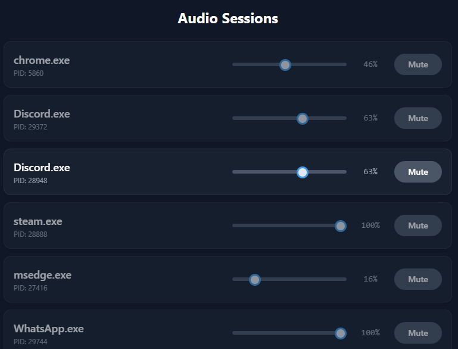

# Sound Control Panel

A custom, real-time volume mixer for Windows built with Rust, Tauri, and Vue 3. This project was created to explore modern desktop development and interfacing with low-level Windows Core Audio APIs.

---

### Core Features

*   **Live Session Discovery:** Automatically detects and displays applications as they start or stop playing audio.
*   **Real-Time UI:** The session list and volume levels update instantly in response to system events.
*   **Per-App Volume Control:** Provides individual volume sliders and mute controls for each audio session.
*   **Lightweight & Performant:** Built with Rust for a minimal resource footprint.

### Key Technical Achievements

This project demonstrates a practical application of several key technologies and concepts:

*   **Backend:** Interfaced with Windows Core Audio COM APIs (`IAudioSessionNotification`, `IAudioSessionEvents`) using the **Rust** `windows-rs` crate.
*   **Architecture:** Implemented a persistent background service on a dedicated thread to monitor system events, decoupled from the UI.
*   **Framework:** Used **Tauri** to build a cross-platform-ready desktop application with a web-based frontend.
*   **Frontend:** Created a responsive and reactive UI with **Vue 3** (Composition API) and **TypeScript**, driven by events pushed from the Rust backend.

### Tech Stack

*   **Backend:** Rust | Tauri
*   **Frontend:** Vue 3 | TypeScript
*   **Styling:** Tailwind CSS

---

This project is licensed under the **MIT License**.